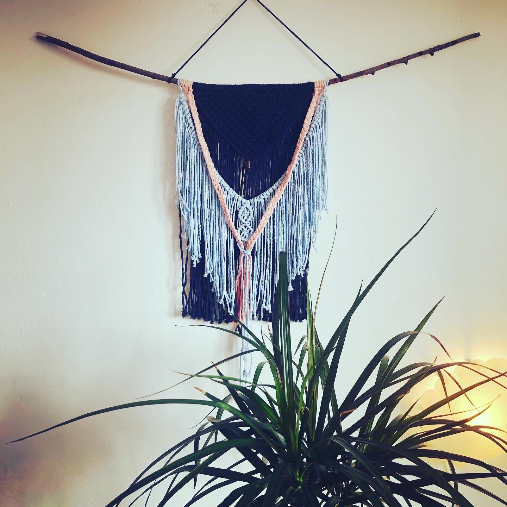
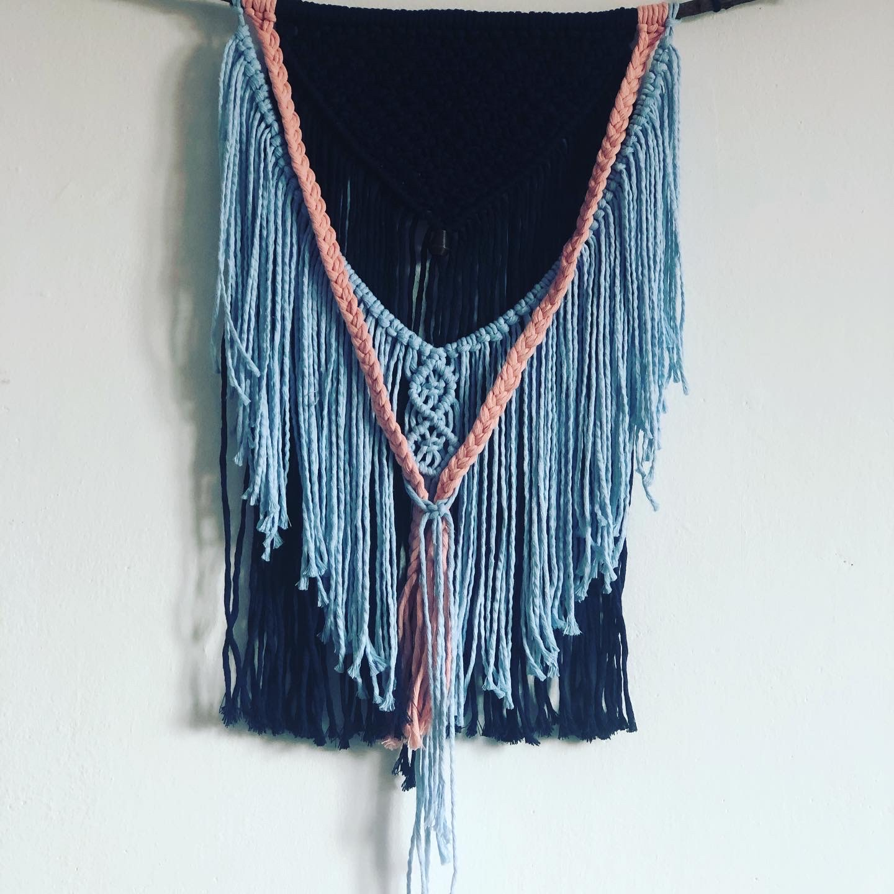
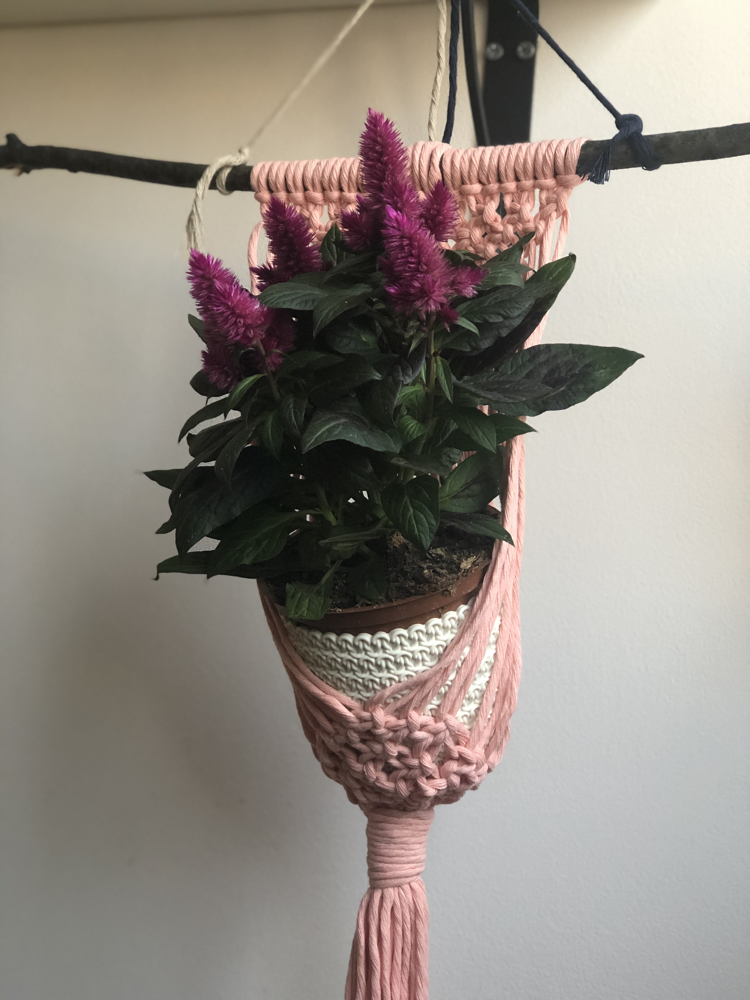
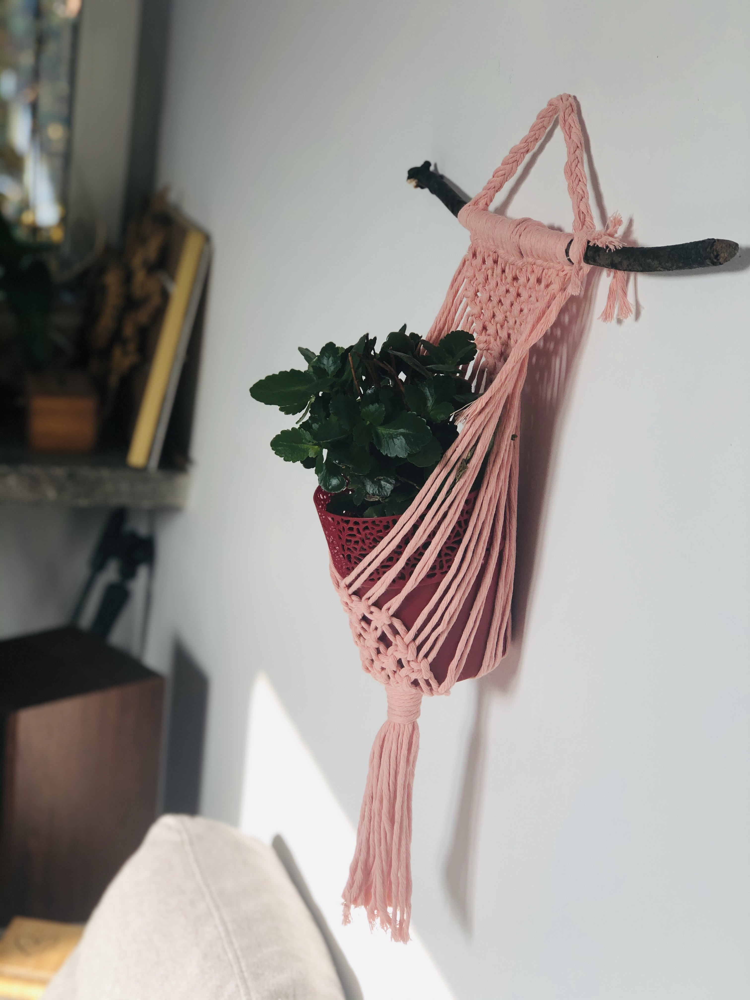
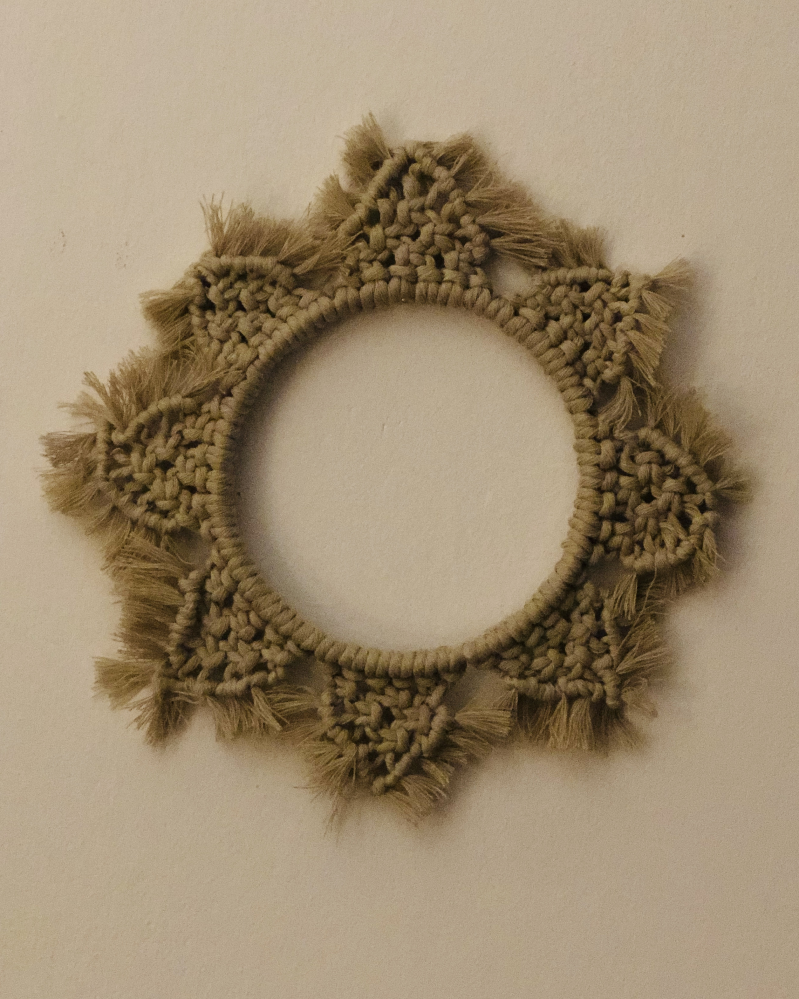
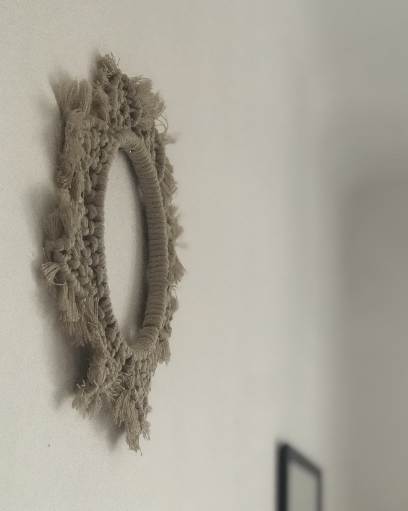

<!DOCTYPE html>
<html lang="en">

<head>
  <meta charset="UTF-8">
  <meta name="viewport" content="width=device-width, initial-scale=1.0">
  <meta http-equiv="X-UA-Compatible" content="ie=edge">
  <meta name="decription" content="Lena Romul - Artystka Multimedialna. Muzyka, obraz, rękodzieło.">
  <meta name="keywords" content="lena romul,saksofon,wokal,producent muzyczny,lekcje muzyki,warszawa,makrama,twórz samodzielnie,DIY,kobieta saksofonistka,kompozytor,autor tekstów, muzyka">
  <link rel="stylesheet" href="https://cdnjs.cloudflare.com/ajax/libs/font-awesome/5.14.0/css/all.min.css" integrity="sha512-1PKOgIY59xJ8Co8+NE6FZ+LOAZKjy+KY8iq0G4B3CyeY6wYHN3yt9PW0XpSriVlkMXe40PTKnXrLnZ9+fkDaog==" crossorigin="anonymous" />
  <link rel="stylesheet" href="https://stackpath.bootstrapcdn.com/bootstrap/4.4.1/css/bootstrap.min.css" integrity="sha384-Vkoo8x4CGsO3+Hhxv8T/Q5PaXtkKtu6ug5TOeNV6gBiFeWPGFN9MuhOf23Q9Ifjh" crossorigin="anonymous">
  <link rel="stylesheet" href="css/style.css">
  <title>Zebra Plecie Makramy</title>
</head>

<body>
  <header>
    <nav id="navbar">
      

<h1 class="logo"><a href="zebrapleciemakramy.html">Zebra Plecie Makramy</a></h1>
        <ul>
          <li><a href="index.html">o autorce</a></li>
          <li><a href="#">allegro</a></li>
        </ul>
      

    </nav>
  </header>
  <section id="contact-form" class="py-3">
    

      

       
      <h5><I>Zebra Plecie Makramy</I></h5>
      to makramy i plecionki na zamówienie. Na stronie prezentuje modele, które wykonuje i wysyłam w ciągu 5 dni roboczych. Można je zamówić na allegro lub indywidualnie poprzez kontakt mailowy: lenaromul@gmail.com &hearts;
       
       
      <h6> Zaplatane pozdrowienia,</h6>
      Lena Romul
      

    

    <section id="czarownica-info">
      

         
        <h3>Sen Czarownicy</h3>
        <h5>Makrama Naścienna</h5>
        

        
        
         
        
Na zdjęciu 60 cm x 30 cm;
            kolory: granat, róż, jasnoniebieski
        

          Rozmiar i kolory ustalamy indywidualnie.

           Dostawa: do 5 dni roboczych

           Cena: 50 - 150 zł ( w zależności od rozmiaru)
        

        <h5 class="card-title">Zamów na <a href="https://www.karrot.pl/lenaromul" <button class="button"> <i class="fas fa-compact-disc"></i> allegro</button> </a></h5>
         
        

      

    </section>
    <section id="czarownica-info">
      

         
        <h3>Mokosz</h3>
        <h5>Makrama na Doniczkę</h5>
        

        
        
         
        
Na zdjęciach 30 cm długości makramy (rozmiar bez ogona); w środku doniczka 15 cm (średnica) x 15 cm (długość);
            kolory: róż, granat
        

          Rozmiar i kolory ustalamy indywidualnie.

           Dostawa: do 5 dni roboczych

           Cena: 50 - 80 zł ( w zależności od rozmiaru)

        <h5 class="card-title">Zamów na <a href="#" <button class="button"> <i class="fas fa-compact-disc"></i> allegro</button> </a></h5>
         
        

      

    </section>

    <section id="czarownica-info">
      

         
        <h3>Mandala Joni</h3>
        <h5>Makrama Naścienna</h5>
        

        
        
         
        
Na zdjęciu 20 cm x 20 cm;
            kolory: beżowy, jasny brąz;
        

          Rozmiar i kolory ustalamy indywidualnie.

           Dostawa: do 5 dni roboczych

           Cena: 30 - 80 zł ( w zależności od rozmiaru)
        

        <h5 class="card-title">Zamów na <a href="https://www.karrot.pl/lenaromul" <button class="button"> <i class="fas fa-compact-disc"></i> allegro</button> </a></h5>
         
        

      

    </section>

    <footer id="main-footer">
      
Lena Romul &copy; 2020

      
lenaromul@gmail.com

    </footer>
</body>

</html>
